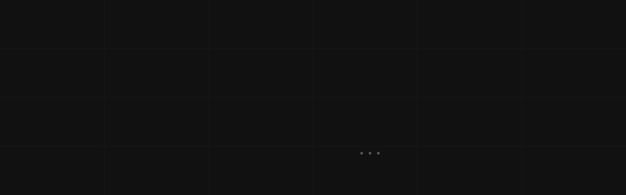

###

  

Atualmente, sou desenvolvedor back-end focado em otimizações de sistemas e construção de aplicações de interface web, usando linguagens como Python com Django, além disso, estou no 4 período de Engenharia de Software na Universidade Estácio de Sá

###

###

  
  
  
  
  
  
  
  
  
  

 

<h2>Redes Sociais</h2>

  
  

 

<picture align="center">
  <source media="(prefers-color-scheme: dark)" srcset="https://raw.githubusercontent.com/jhonatamdantas/jhonatamdantas/output/github-contribution-grid-snake-dark.svg">
  <source media="(prefers-color-scheme: light)" srcset="https://raw.githubusercontent.com/jhonatamdantas/jhonatamdantas/output/github-contribution-grid-snake-dark.svg">
  
</picture>

###
